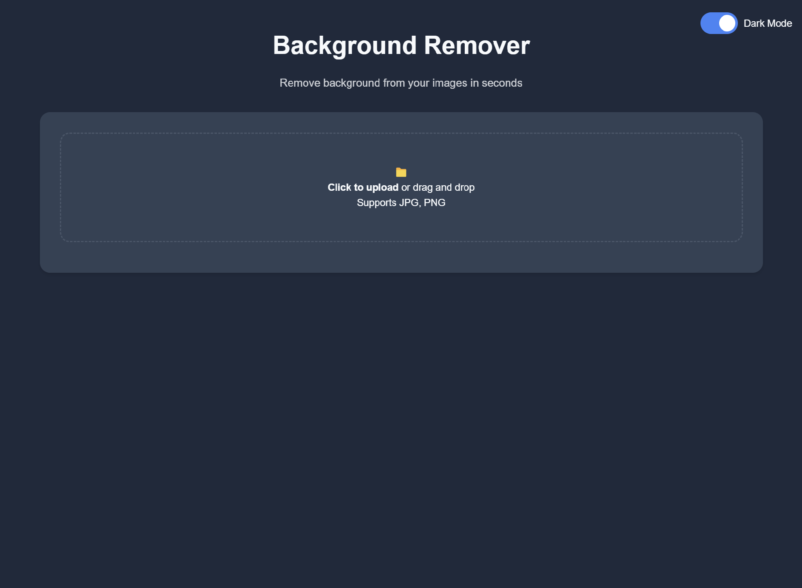
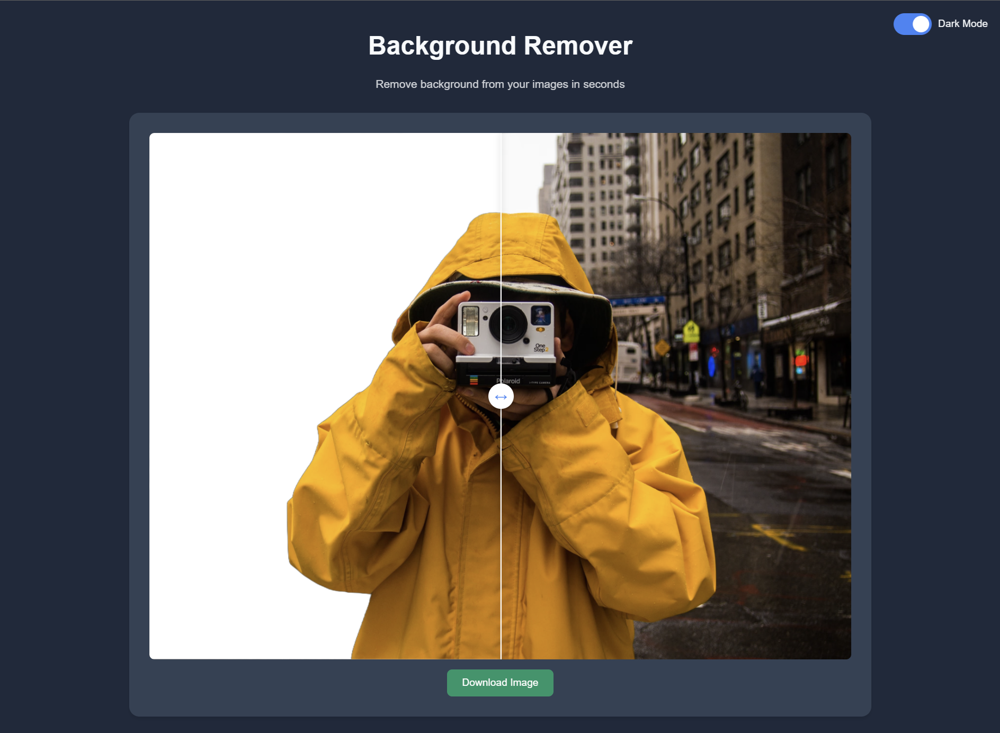

# Image Background Remover Web Application

This web application allows users to remove backgrounds from images with ease using the **RMBG-1.4** model from Hugging Face. With an intuitive interface and advanced functionality, the application provides fast, efficient, and high-quality background removal, suitable for various use cases.

## Key Features

- **Efficient Background Removal:** Utilizes the RMBG-1.4 model for fast and precise background extraction in seconds.
- **User-Friendly Interface:** Drag-and-drop functionality, along with a clean, responsive design, makes the application easy to use.
- **Dark & Light Modes:** Switch between dark and light themes for optimal visibility and user experience.
- **Instant Preview & Comparison:** Users can preview the processed image before downloading, with a slider to compare the original and processed images.
- **Download Processed Images:** Save images directly after background removal, with the option for high-quality output.
- **Lightweight & High-Speed:** The RMBG-1.4 model is optimized for performance, allowing it to run on regular servers without requiring high-end resources.
- **Cross-Browser Compatibility:** Tested across major web browsers to ensure consistent functionality and appearance.

## Technology Stack

- **Backend:** Python, Flask
- **Model:** RMBG-1.4 (Hugging Face)
- **Frontend:** HTML, CSS, JavaScript

## Screenshot

### Interface Before Upload
This is the interface before an image is uploaded:



### Interface After Upload
This is the interface after an image is uploaded and ready for background removal:



## Installation

To set up and run this project locally, follow these steps for both Windows and Linux:

### 1. Clone the Repository
First, clone the repository to your local machine:
```bash
git clone https://github.com/AbolDev/image-background-remover-webapp.git
cd image-background-remover-webapp
```

### 2. Create a Virtual Environment
It's recommended to create a virtual environment to manage dependencies independently of other projects.

#### On Windows
1. Open Command Prompt (CMD) or PowerShell.
2. Run the following commands:
   ```bash
   python -m venv venv
   venv\Scripts\activate
   ```

#### On Linux
1. Open your terminal.
2. Run the following commands:
   ```bash
   python3 -m venv venv
   source venv/bin/activate
   ```

After activating the environment, you should see `(venv)` at the beginning of your command line prompt, indicating that the virtual environment is active.

### 3. Install Dependencies
With the virtual environment active, install the required dependencies using `pip`:
```bash
pip install -r requirements.txt
```

### 4. Run the Application
Once the dependencies are installed, start the Flask web server:

```bash
python app.py
```

By default, the application will be accessible at `http://127.0.0.1:80`.

### Deactivating the Virtual Environment
When you’re done, you can deactivate the virtual environment:

- On Windows, type:
  ```bash
  venv\Scripts\deactivate
  ```
  
- On Linux, type:
  ```bash
  deactivate
  ```

Following these steps ensures a clean and isolated setup, making it easier to manage dependencies and prevent conflicts.

## Usage

1. **Upload Image**: Use the “Click to upload” or drag-and-drop your image file into the designated area.
2. **Remove Background**: Click the "Remove Background" button to start processing.
3. **Download Image**: Once processing is complete, click "Download Image" to save the image with the background removed.

## Example of Background Removal

Below is an example showing an image before and after background removal:

**Original Image:**


**Processed Image:**


## Model Information
The background removal is powered by the **RMBG-1.4** model, provided by Hugging Face. This model is lightweight and designed to operate on typical server setups, offering reliable and high-speed performance without requiring GPU resources. For more details, visit the [model page on Hugging Face](https://huggingface.co/briaai/RMBG-1.4).

---

Feel free to reach out for support or contribute to the project through the repository’s issue tracker. We welcome any feedback or suggestions to enhance the application.
